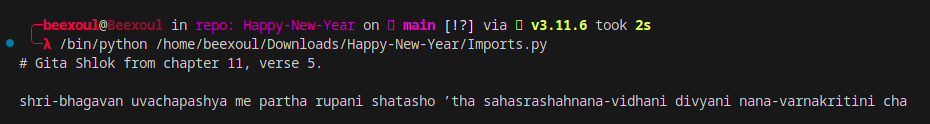

# Bhagavad Gita Verse Generator

This Python script generates random verses from the Bhagavad Gita and displays them in a formatted manner. The script utilizes web scraping techniques to extract verses from the [Holy Bhagavad Gita](https://www.holy-bhagavad-gita.org/) website.



## Changes Made for Improved Code Quality

### 1. Dictionary for Verse Ranges

To enhance code readability and maintainability, a dictionary named `VERSE_RANGES` is introduced. It stores the maximum number of verses for each chapter, replacing the previous if-elif statements. This change simplifies the logic and allows for easy updates.

```python
VERSE_RANGES = {
    1: 47, 2: 72, 3: 43, 4: 42, 5: 29,
    6: 47, 7: 30, 8: 28, 9: 34, 10: 42,
    11: 55, 12: 20, 13: 35, 14: 27, 15: 20,
    16: 24, 17: 28, 18: 78
}
```

### 2. Formatted String Literal (f-string)

In the `generate_link` function, f-strings are used for formatting the link. This makes the code concise and more readable.

```python
def generate_link(chapter, verse):
    return f"https://www.holy-bhagavad-gita.org/chapter/{chapter}/verse/{verse}"
```

### 3. Refactored `get_p` Function

The `get_p` function is renamed to `main` for better clarity. Additionally, the handling of paragraphs in the scraped HTML is improved for better readability.

```python
def main():
    # ... (Check full code for details)
    formatted_transliteration = ""
    if transliteration_wo_dia:
        paragraphs = transliteration_wo_dia.find_all("p")
        formatted_transliteration = "\n".join(paragraph.text.strip() for paragraph in paragraphs)
    # ...
```

### 4. Variable Naming and Comments

Variable names are updated for better readability, and comments are added to explain the purpose of certain code blocks. This makes the code more understandable for developers.

### 5. Handling Missing Element

The code now checks if the element with id "transliteration_wo_dia" exists before attempting to extract paragraphs. This prevents potential issues if the element is not present on the webpage.

### 6. Formatted Print Statement

The print statement at the end is formatted using an f-string for better readability.

```python
print(f"# Gita Shlok from chapter {chapter}, verse {verse}.\n")
```

## How to Use

1. Ensure you have Python installed on your system.
2. Install the required packages by running `pip install -r requirements.txt`.
3. Run the script using `python bhagavad_gita_verse_generator.py`.
4. The script will output a randomly selected verse from the Bhagavad Gita.

Feel free to explore and customize the script as needed. Enjoy exploring the wisdom of the Bhagavad Gita!
